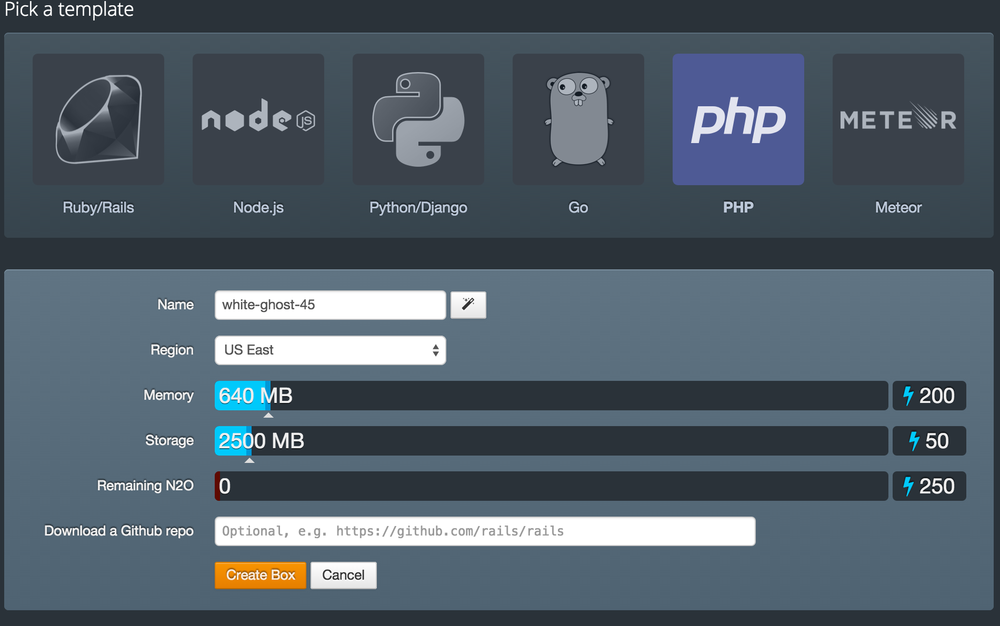
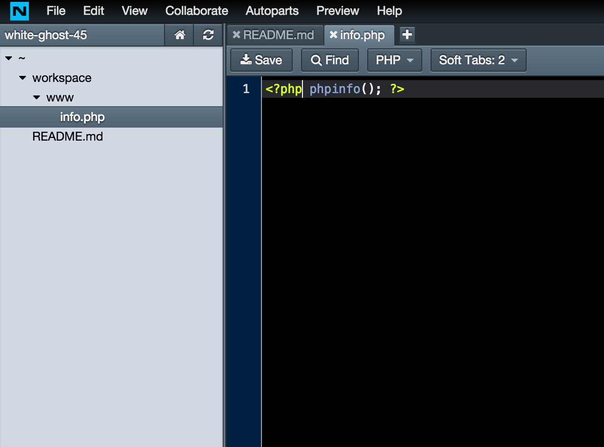
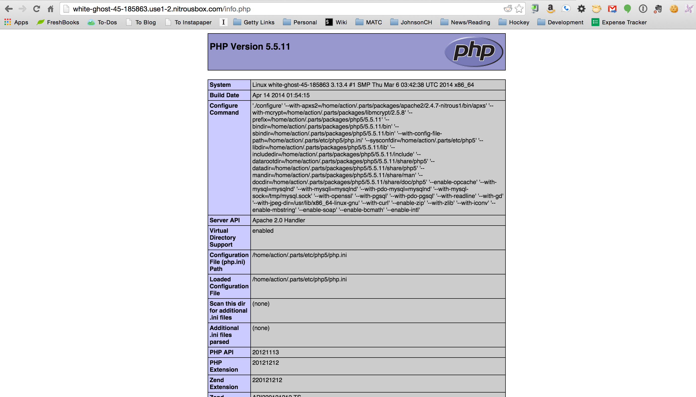

#PHP Web Development with MySQL
###Setting up Nitrous.io

---
##Signup
###[https://www.nitrous.io/join/xAc6XsTB2BA](https://www.nitrous.io/join/xAc6XsTB2BA)

---
#Create a box

---


---
#Let's add our first PHP page!

---
##Create an info.php file inside of workspace>www


---
##Add the following code to the page:
```
<?php phpinfo(); ?>
```

---
##Then we can view it

